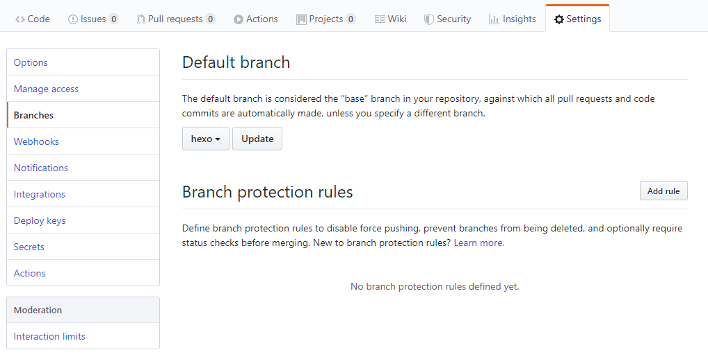

有时，我们在笔记本上编辑了博客，并发布到了网上。但回家后，想用家里的台式进行修改，却发现电脑上没有对应文件，可以说是非常难受。这里，我们可以将整个项目上传到github。这样，每次打开不同电脑，只需要进行简单的git pull命令，就能把文件同步下来，进行多终端无缝操作。


参考资料：
- 使用hexo，如果换了电脑怎么更新博客？:[链接](https://www.zhihu.com/question/21193762)
- hexo教程:基本配置+更换主题+多终端工作+coding page部署分流(2):[链接](http://fangzh.top/2018/2018090715/)

# 原理
首先我们需要知道，我们使用```hexo deploy```传到github上的仅仅是hexo编译完成的博客页面。因此github上储存的不是源文件，我们无法使用这些文件进行有效的编辑来修改或重新生成博客。因此我们需要想办法将原始文件传到github上。实现方法十分简单，在git中创建一个新分支，将hexo的源文件传到该分支即可

# 创建并上传分支
首先，hexo默认deploy的文件存放在这个repo的master分支中，因此我们创建一个新分支。这里命名为hexo分支。然后在该repo的setting中，将hexo分支设为默认分支。这样每次同步时自动同步到hexo分支，而```hexo deploy```自动部署到master分支，节省操作。


在本地，使用git命令将新分支clone到本地。
```
git clone https://github.com/username/username.github.io
```

接下来进行一些暴力操作，将新分支文件夹中除了```.git```文件夹的所有文件删除，将原hexo文件夹的除了```.git```文件夹的所有文件移动到新分支文件夹。同时，检查并确保```.gitignore```文件中内容如下。这些文件包含npm安装在本地的插件等，不需要被上传到git。
```
.DS_Store
Thumbs.db
db.json
*.log
node_modules/
public/
.deploy*/
```

注意，如果你之前克隆过theme中的主题文件，那么应该把主题文件中的.git文件夹删掉，因为git不能嵌套上传。建议显示隐藏文件，检查一下，否则上传的时候会出错，导致你的主题文件无法上传，这样你的配置在别的电脑上就用不了了。

最后使用如下命令push分支。可以到github页面检查一下成果。
```
git add .
git commit –m "add branch"
git push 
```

# 新电脑配置
首先在新电脑上配置环境。安装git，node.js, npm

- 设置git全局邮箱和用户名
  ```
  git config --global user.name "yourgithubname"
  git config --global user.email "yourgithubemail"
  ```
- 设置SSH key
  ```
  ssh-keygen -t rsa -C "youremail"
  #生成后填到github和coding上（有coding平台的话）
  #验证是否成功
  ssh -T git@github.com
  ssh -T git@git.coding.net #(有coding平台的话)
  ```
- 安装hexo
- npm install hexo-cli -g
  
在任意文件夹下，clone repo
```
git clone https://github.com/username/username.github.io
```
进入文件夹，使用npm安装插件
```
cd name.github.io
npm install
npm install hexo-deployer-git --save
```
生成hexo，测试
```
hexo g
hexo s
```
之后就可以正常使用了

# 使用事项
每次完成一篇博文，都记得要使用```hexo d```和```git push```将两个分支都更新。这样在另一台终端操作时，只需要进行```git pull```就ok了
